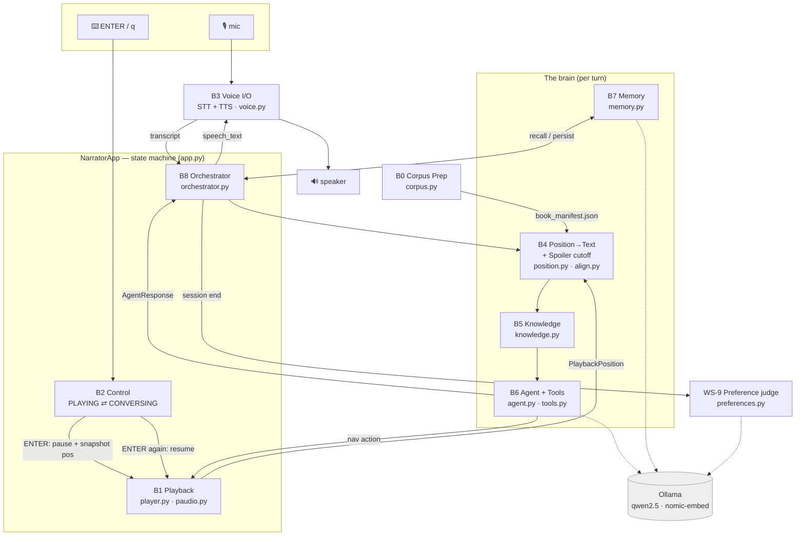
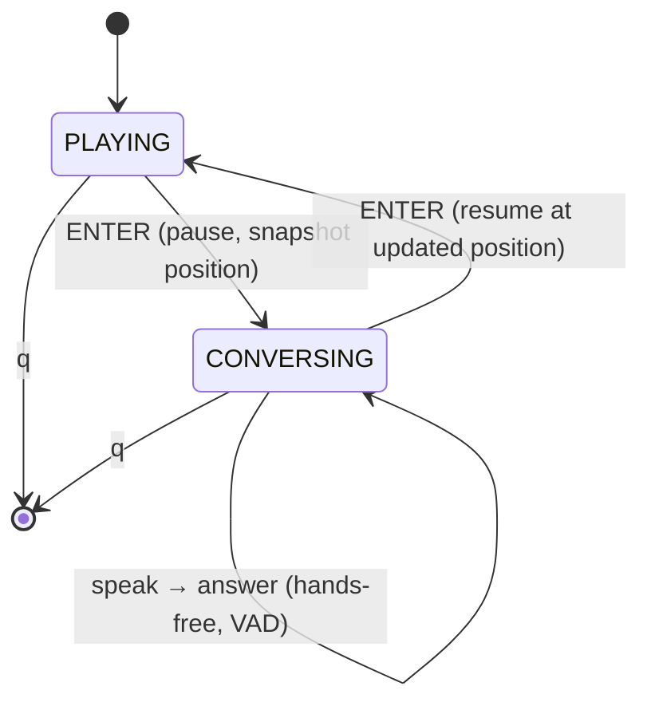
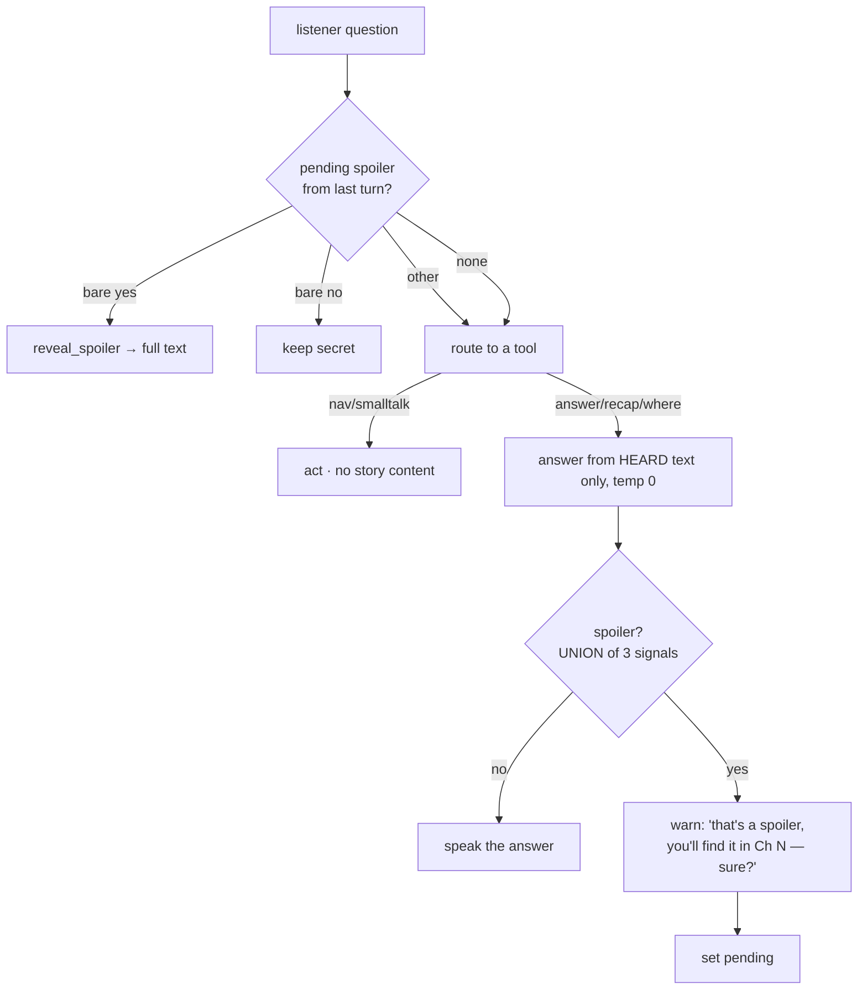
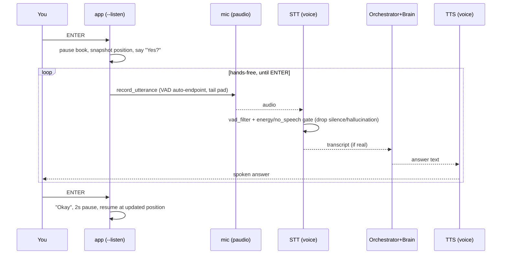

# Architecture — Audiobook Narrator

A fully-local, voice-driven companion layered over an audiobook. You listen; press
**ENTER** to pause and talk (by voice); the narrator answers **spoiler-safely** based
on how far you've listened; press **ENTER** again to resume. Everything — LLM, STT,
TTS, embeddings, memory — runs on this machine, inside this project.

This document is the map: the block diagram, what each block/sub-block does with its
inputs and outputs, every LLM **tool**, the **spoiler gate**, and the data contracts.

---

## 1. Big picture



**State machine (control):**



Exactly **two ENTERs per talking session** (one to enter, one to resume); everything
in between is voice. `q` quits. (The legacy `--voice`/`--text`/`--demo` "Hey Narrator"
phrase drivers still exist for testing, but the primary experience is `--listen`.)

---

## 2. Blocks — inputs & outputs

| Block | File(s) | Input | Output |
|---|---|---|---|
| **B0 Corpus Prep** | `corpus.py` | `book.txt` + audio (per-chapter wavs *or* one combined wav) | `data/book_manifest.json` |
| **B1 Playback** | `player.py`, `playback.py`, `paudio.py` | play/pause/resume/seek/goto + manifest | `PlaybackPosition`, live audio |
| **B2 Control** | `app.py`, `control.py` | ENTER/`q` (or phrases in legacy modes) | state transitions |
| **B3 Voice I/O** | `voice.py`, `paudio.py` | mic audio / text | transcript / spoken audio |
| **B4 Position→Text + Spoiler cutoff** | `position.py`, `align.py` | `PlaybackPosition` + manifest | `HeardCutoff` |
| **B5 Knowledge** | `knowledge.py` | `HeardCutoff` / manifest | heard-only or full context string |
| **B6 Agent + Tools** | `agent.py`, `tools.py`, `llm.py` | transcript, cutoff, context, memory | `AgentResponse` |
| **B7 Memory** | `memory.py` | turns, session end, a query | resume pos, summaries, semantic recall |
| **B8 Orchestrator** | `orchestrator.py` | one utterance | `AgentResponse` + applied nav |
| **WS-9 Preferences** | `preferences.py` | saved session transcripts | `data/preferences/<book>.json` |

### B0 Corpus Prep — sub-blocks
- **Title resolver** (`resolve_title`): `$NARRATOR_TITLE` → `data/book_meta.json` → first line of `book.txt` → fallback. *Not hardcoded to any story.*
- **Marker detector** (`_detect_marker`, `split_sections`): auto-detects Roman numerals, `Chapter N[: title]`, plain `N.`, or markdown `#` headings; picks the style that yields ≥2 sections; else one chapter.
- **Audio mapper** (`build_manifest`): **Mode A** per-chapter wavs (N wavs == N sections); **Mode B** single combined wav split by time — boundaries from `chapters.json` → proportional-by-characters; `$NARRATOR_AUDIO` forces Mode B. Each chapter carries `audio_start_sec` (offset inside a shared wav; `0.0` for per-chapter).

### B4 Position→Text + Spoiler cutoff — sub-blocks
- **Time↔char map** (`time_to_char`, `char_to_time`): **forced alignment** if `data/alignment/chapter_<i>.json` exists (exact), else **proportional-by-time**.
- **Cutoff builder** (`resolve`): assembles `heard_text` = all prior chapters + heard slice of the current chapter; sets `unheard_exists`.
- **Phrase finder** (`find_phrase`): exact→fuzzy text search → char offset → time (powers `restart_from_phrase`).

### B7 Memory — sub-blocks
- **Resume position**: where playback restarts next launch.
- **Session summaries**: last-N one-line notes (LLM-written at session end, spoiler-free).
- **Semantic recall** (WS-8): each listener ask + summary is embedded (`nomic-embed-text`) and stored; per turn, `turn_context(query)` returns recent summaries + top-K cosine-nearest past items. Falls back to summaries if embeddings are down.

---

## 3. LLM tools (B6)

Every capability is an explicit tool. Per turn, the model picks **one** via Ollama
native tool-calling (`llm.chat_tools`); `agent.respond` runs the handler. A keyword
router (`_keyword_route`) is the fallback if tool-calling misfires. **`reveal_spoiler`
is intentionally NOT offered to the model** — unheard content is reachable only through
the deterministic warn-then-confirm gate.

| Tool | Args | Handler does | Story content? | Side effects |
|---|---|---|---|---|
| `answer_about_story` | `query` | Answer from heard text (temp 0), then run the spoiler gate | heard-only, or warn | none |
| `recap` | `focus?` | Recap the heard portion (optionally focused) | heard-only | none |
| `summarize_chapter` | `index?` | Summarize a **fully-heard** chapter; else warn-and-confirm | heard-only / gated | none |
| `where_am_i` | — | Describe current setting, spoiler-safe | heard-only | none |
| `goto_chapter` | `index` | Move resume point to a chapter start | none | position |
| `skip_chapter` | — | Move to next chapter | none | position |
| `restart_from_phrase` | `phrase` | Find a quoted line → set resume there | none | position |
| `set_resume_position` | `chapter`,`position_sec` | Set an exact resume point | none | position |
| `smalltalk` | `reply` | Greetings/thanks | none | none |
| *(`reveal_spoiler`)* | — | **Internal only** — answers from full text after confirmation | full text | none |

Routing map (utterance → tool) lives in `tools._ROUTER_SYSTEM`.

---

## 4. The spoiler gate (WS-2) — the core reliability work



**Three structurally-safe signals — warn if ANY fires** (`agent._is_spoiler`). All
three can only ever cause *over-warning*, never a leak, because none of them ever puts
unheard text into a spoken answer:

1. **`NEED_SPOILER` sentinel** — the heard-only answer prompt emits this token when the
   answer isn't in the heard text (the model only sees heard text).
2. **`target_chapter > current`** — a separate check names the 1-based chapter that
   first answers the question (emits only a *number*, never content); if it's a future
   chapter, it's a spoiler. Makes "who is X" safe once X has appeared.
3. **Heard-only gate** — an independent judge that sees only the heard text.

**Consent is deterministic**, never the model's call: `wants_spoiler` (explicit opt-in
like "I don't care, tell me") reveals immediately; otherwise the narrator **warns and
waits**, and only a **bare** `yes`/`no` (`is_pure_confirmation` / `is_pure_negation` —
an utterance carrying its own request like "ok, skip to chapter 3" is *not* consent)
resolves it on the next turn.

Measured on the test corpus across four positions: **0 false-positives**, and the only
residual miss is asking a character's fate once already inside the final chapter. For an
**unknown** book the gate is even safer — the model has no pretrained plot to leak.

---

## 5. Voice pipeline (WS-5 / WS-7)



- **Hands-free turns**: `paudio.record_utterance` uses energy VAD with `tail_pad_sec`
  so the last word isn't clipped, and a `should_stop` poll so a second ENTER interrupts
  listening instantly.
- **Robustness (WS-7)**: `STT.transcribe_checked` rejects near-silent input (RMS gate)
  and lone classic hallucinations ("Thank you.") using `vad_filter` + `no_speech_prob`.
- **No echo problem**: the book is paused while you talk and TTS/mic are sequential, so
  no acoustic echo cancellation is needed (this is why 2-ENTER is more reliable in WSL2
  than always-on wake-word over playing audio).

---

## 6. Data contracts

```
ChapterMeta      { index, title, text, char_count, audio_path, audio_start_sec, duration_sec }
book_manifest    { title, n_chapters, single_file, chapters:[ChapterMeta] }
PlaybackPosition { chapter_index (1-based), position_sec }
HeardCutoff      { chapter_index, char_offset, heard_text, unheard_exists }
AgentResponse    { speech_text, action{type,…}, intent, tool, spoiler_used,
                   needs_confirmation, pending_spoiler }
alignment/chapter_<i>.json { chapter_index, duration_sec, points:[[t_sec, char_offset], …] }
```

### Preference JSON (WS-9) — handoff to the black-box audiobook generator
`data/preferences/<book_id>.json`, self-describing and versioned:
```json
{
  "schema_version": "1.0",
  "book_id": "<slug of title>",
  "generated_at": "<iso8601>",
  "applies_from_chapter": <int>,
  "signals": { "n_turns": N, "meaning_requests": N, "summary_or_skip_requests": N },
  "preferences": {
    "vocabulary": { "value": "simplified|as_written", "confidence": 0.0, "evidence": ["…"] },
    "pacing":     { "value": "condensed|full",        "confidence": 0.0, "evidence": ["…"] }
  },
  "instructions_for_generator": "Plain-language directive; preserves plot, names, and reveal order."
}
```
Signals: frequent **meaning** questions → `vocabulary: simplified`; frequent
**summary/skip** requests → `pacing: condensed`. Low confidence → the safe default
(`as_written` / `full`).

---

## 7. Local model stack

| Role | Model | Where | Notes |
|---|---|---|---|
| Brain | `qwen2.5:7b-instruct` (14b opt-in via `$NARRATOR_LLM`) | `models/ollama/` | native tool-calling |
| STT | faster-whisper `small.en` (auto), else `base.en` | `models/speech/hf/` | `vad_filter`, word timestamps |
| TTS | Kokoro-82M (`af_heart`) | `models/speech/hf/` | GPU/CPU |
| Embeddings | `nomic-embed-text` | `models/ollama/` | semantic memory (WS-8) |

All served locally by Ollama (`localhost:11434`) or loaded offline from the in-project
HF cache. No cloud, no API keys.

---

## 8. How to extend

- **New capability** → add a schema to `tools.TOOL_SCHEMAS` + a branch in
  `agent.respond`; document it in §3.
- **Better alignment** → replace `align.align_chapter`; `position.py` consumes the same
  `points` contract, no caller changes.
- **Long books / RAG** → swap `knowledge.heard_context` for a retrieval implementation;
  the `HeardCutoff` contract is unchanged. (Full-context is fine while a book fits the
  8k window.)
- **Real mem0 / vector DB** → replace the numpy cosine store in `memory.py` behind
  `semantic_recall`.
- **Hands-free wake word** → add an openWakeWord source in `control.py` feeding the same
  state machine; the 2-ENTER path stays as the reliable fallback.

See `README.md` for setup/run and `goal.md` for the original design intent.
```
